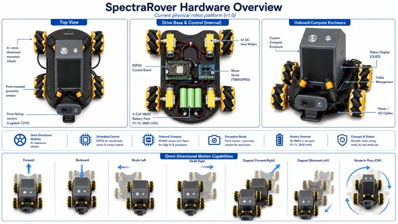

# SpectraRover Hardware Notes

This document separates **confirmed/visible components**, items that still need electrical verification, and optional additions for later stages.



## Confirmed / clearly identified hardware

### Compute and control

- NVIDIA Jetson Orin Nano Developer Kit 8 GB — high-level compute, vision, navigation, and future RF/AI processing
- ESP32 DevKit-style microcontroller on a screw-terminal expansion board — low-level motor/safety controller
- Seeed Studio XIAO RP2040 available as an auxiliary MCU
- Arduino Uno-compatible boards available for bench/prototyping work

### Mobility

- four-wheel mecanum / omni-directional chassis
- 4 x yellow TT-style geared DC motors
- L298N H-bridge hardware available/currently used in the existing build
- 2 x TB6612FNG dual H-bridge breakout boards available for independent four-motor control

### Vision, sensing, and UI

- Logitech C270 USB webcam — confirmed front camera option and current reference navigation camera
- front-mounted cylindrical yellow/orange proximity/photoelectric sensors — exact model/output interface still requires electrical verification
- HC-SR04 ultrasonic modules available
- IR receiver module available
- u-blox NEO-6M GPS receiver + external antenna available for outdoor logging
- small I2C OLED display associated with the compute enclosure

### Power

- 3-cell 18650 battery holder/pack used by the current robot power system
- power wiring and connectors integrated with the chassis
- prototyping power modules available

The exact cell capacity, protection/BMS arrangement, regulator topology, and maximum current capability should be verified from the physical pack before publishing electrical ratings or a definitive power schematic.

### Prototyping inventory

- breadboards
- jumper wires
- resistors
- LEDs
- buttons/switches
- general prototyping components

## Camera plan

The Logitech C270 is sufficient for the first controlled autonomous-navigation and pre-HackRF demonstration.

Recommended first configuration:

1. mount the C270 as the forward navigation camera
2. calibrate the exact camera/lens combination using `scripts/calibrate_camera.py`
3. use known ArUco markers for repeatable indoor reference navigation
4. keep the higher-level vision interface camera-agnostic so other USB/CSI cameras can be evaluated later without changing the navigation API

Multiple-camera/stereo experiments remain possible, but are not needed for the first reproducible demonstration.

## Components requiring electrical verification

The cylindrical yellow/orange chassis sensors resemble E18-D80NK-style photoelectric/IR proximity sensors or a related family. Appearance alone is not enough to identify their output circuitry. Confirm the exact part number, supply range, output type, and logic voltage before connecting them to ESP32 or Jetson GPIO.

An ACEBOTT packaged sensor was also shown in the available component inventory, but the exact model is not sufficiently identified to make it part of the baseline design.

## Motor-driver plan

Mecanum motion benefits from independent control of all four motors.

Candidate configuration:

- TB6612FNG #1 -> front-left + front-right
- TB6612FNG #2 -> rear-left + rear-right
- shared STBY control
- one PWM + two direction signals per motor

The TB6612FNG topology is more efficient than the classic L298N design, but the final choice depends on the real motor current. **Do not assume the TB6612FNG boards are sufficient until motor stall current has been measured or obtained from a reliable motor specification.** If the current is too high, select a higher-current four-channel arrangement instead.

## Navigation and localization

The current software supports camera-referenced navigation and generic 2D waypoint control. For the first controlled indoor demonstration, the lowest-risk localization path is:

### Camera + ArUco reference navigation

- uses the existing C270
- no wheel-hardware change required
- deterministic indoor targets are easy to reproduce
- camera calibration and marker tools are already in the repository

### Longer-term odometry / SLAM additions

For general navigation beyond a controlled marker environment, useful additions would be:

- wheel encoders or encoder-equipped motors
- IMU such as BNO085/BNO055, ICM-20948, MPU-6050/9250, or similar
- 2D lidar or depth camera for SLAM/obstacle mapping

GPS (NEO-6M) remains useful for outdoor logging but is not the primary indoor localization source.

## Optional additions to look for in the component collection

- wheel encoders / magnetic encoder modules
- IMU
- physical emergency-stop button or latching power switch
- power regulator sized for the Jetson and motor rails
- current/voltage monitor such as INA219/INA226
- motor suppression capacitors and ferrites
- directional antenna for later RF source-seeking experiments

A new camera is not currently a priority.

## RF integration design notes

The rover is itself an RF-noisy platform. Likely self-interference sources include:

- DC motor commutation
- PWM motor drive
- DC/DC power conversion
- Jetson compute electronics
- USB links
- display/sensor wiring

For the first HackRF integration, place the SDR/antenna as far from the motor and power electronics as practical and characterize the rover's own emissions before interpreting environmental measurements.

A useful measurement mode is:

```text
MOVE -> STOP MOTORS -> WAIT FOR EMI TO SETTLE -> CAPTURE RF -> ANALYZE -> MOVE
```

The runtime configuration already exposes `settle_before_rf_s` for this experiment design.
